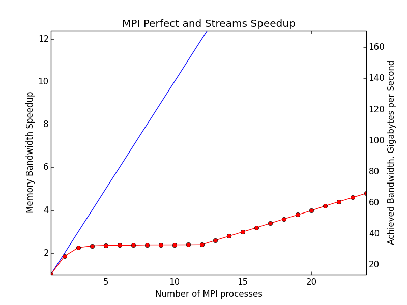

# Firedrake on Archer

Add the following to your `.pbs` file to load the Firedrake environment:
```
module swap PrgEnv-cray PrgEnv-gnu
source /work/y07/y07/fdrake/firedrake.env
export MPICH_GNI_FORK_MODE=FULLCOPY

export PYOP2_CACHE_DIR=/path/to/work/with/write/access/pyop2cache
export FIREDRAKE_TSFC_KERNEL_CACHE_DIR=/path/to/work/with/write/access/firedrake-kernel-cache
```

The firedrake installation was last updated on 2016-07-12.

## Updating installation

If you have access to the firedrake package account:

```
su -l fdrake
module use $WORK
module swap PrgEnv-cray PrgEnv-gnu
module load pets-build-env
cd $HOME/petsc
git pull
make PETSC_DIR=`pwd` PETSC_ARCH=petsc-configure all
make PETSC_DIR=`pwd` PETSC_ARCH=petsc-configure install
source $WORK/firedrake.env
firedrake-update --honour-petsc-dir
```


### Results



```
STREAM Triad numbers (compiled with gcc 4.9.1 cc -O2 -fPIC)
# nprocs MB/s
1 15218.5798
2 26044.8373
3 32489.4984
4 34929.4147
5 36030.9600
6 36560.5192
7 36858.5365
8 37011.9665
9 37076.0461
10 37128.6869
11 37185.4419
12 37259.8940
13 40288.8719
14 43310.2500
15 46454.4082
16 49586.8287
17 52627.4048
18 55711.5052
19 58812.1194
20 61829.0734
21 64976.4766
22 68109.9680
23 71058.1668
24 74103.9701
```