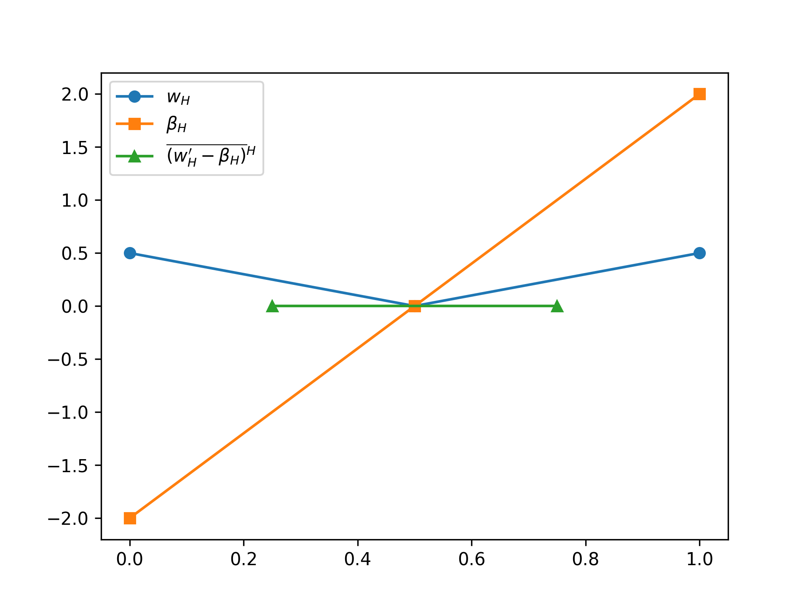
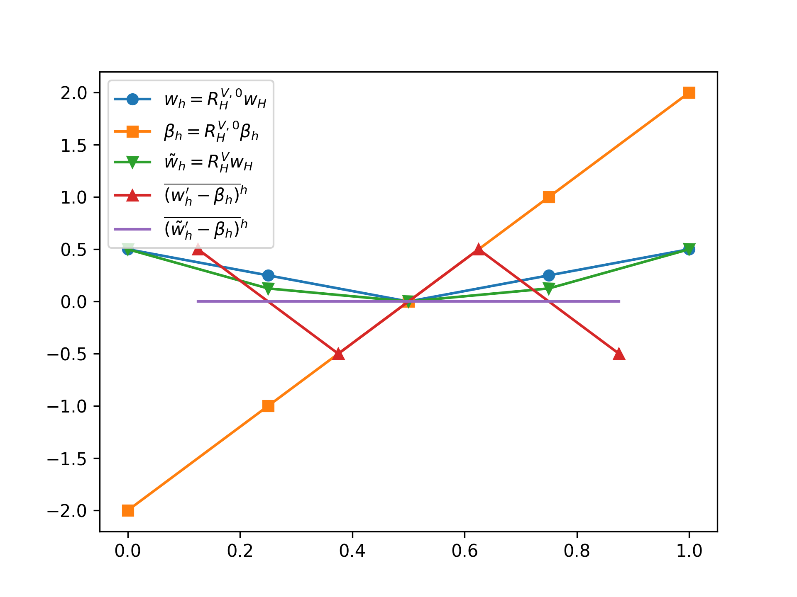

We are reading through [Joachim Schöberl's thesis](https://www.asc.tuwien.ac.at/~schoeberl/wiki/publications/diss.pdf) on parameter robust multigrid methods.

The scheduled time is Mondays at 14:00 BST. [This calendar](https://calendar.google.com/calendar/embed?src=qbaqqtn2iiu5l6qjbf2t4aafa8%40group.calendar.google.com) contains details.

Discussion is via Zoom:

- Meeting ID: 958 2789 9769
- Password: 982161

## Notes and queries as we go

### Chapter 1

#### 2020-05-25

In the analysis of the multigrid methods, the theory is that of Hackbusch (approximation and smoothing properties). These days, tighter bounds are available. Matt likes the paper of [Brannick et al.](https://arxiv.org/abs/1703.10240), which expands on theory originally developed in [Falgout, Vassilevski, and Zikatanov (2005)](https://onlinelibrary.wiley.com/doi/abs/10.1002/nla.437) and also covered in [Xu and Zikatanov's algebraic multigrid review](https://arxiv.org/abs/1611.01917).

Schöberl considers the parameter-dependent problem requiring that Aε is coercive. Patrick wonders if we can consider how the theory maps on to the case where we only have that the eigenvalues of Aε are bounded away from zero.

A request that we carefully unpick, when going through proofs, all of the constants in the inequalities of the form a ≼ b (so that we see where all the bits came from).

### Chapter 2

#### 2020-06-01
We covered the basics of finite element approximation and showed how conforming discretisations can fail for parameter dependent problems. Ivan notes that his [masters thesis](https://aaltodoc.aalto.fi/bitstream/handle/123456789/31490/master_Yashchuk_Ivan_2018.pdf?sequence=1&isAllowed=y) contains an example of this for the case of the Poisson equation with varying coefficients (in section 3.3).

We got a little hung up on Hilbert space interpolation. Gonzalo suggests that this is going to be used in the multigrid convergence proof later (this theory is in [Bramble](https://doi.org/10.2307/2153359)). [Brenner & Scott](https://doi.org/10.1007/978-0-387-75934-0) have a reasonably self-contained overview of Hilbert space interpolation and its relation to finite elements in Chapter 14 of their book.

#### 2020-06-08

We introduced more finite element theory. In particular Scott-Zhang interpolation, inverse inequalities, and partition of unity methods. We then started on theory for parameter-dependent problems and the migration to a mixed formulation. We showed that the mixed problem Bε has parameter-dependent continuity constant in the parameter-dependent V×εQ-norm. We finished with discussion of the remark before Theorem 2.8 and the introduction of the dual ||·||Q,0 norm, which is introduced such that ΛV has closed range with respect to this new norm. Gonzalo wrote up some more detailed notes [explaining this point](docs/operators-dense-range-inf-sup.pdf).

#### 2020-06-15

We covered the parameter-dependent case of the mixed problem and introduced some new norms, along with Fortin operators as a useful tool for moving from continuous to discrete inf-sup conditions.

#### 2020-06-22

We gathered our thoughts before embarking on examples, particularly, we reminded ourselves of the various different norms in play.

- ||u||V = (u, u)V½
- ||u||Aε = Aε(u, u)½
    - A1 is V-elliptic, so norm-equivalence ||u||V ≃ ||u||A1
- ||p||c = c(p, p)½
- ||u, p||V×εc = (||u||2V + ε||p||c2)½
- ||p||Q,0 ≃ supv ∈ V c(Λ v, p)/||v||V
- ||p||Q = (||p||Q,02 + ε||p||c2)½
- ||u, p||X = ||u||V + ||p||Q

Also have some norms on the discrete spaces.

- ||uh||Ahε = Ahε(u, u)½
    - In general must check Vh ellipticity of  Ah1, if we have it, then ||u||V ≃ ||u||Ah1
- ||ph||Qh,0 ≃ supvh ∈ Vh c(Λh vh, p)/||vh||V
- ||ph||Qh = (||ph||Qh,02 + ε||ph||c2)½
- ||uh, ph||Xh = ||uh||V + ||ph||Qh

Existence of a Fortin operator is required so that we have equivalence of ||·||Q and ||·||Qh (and then ||·||X and ||·||Xh).

We then briefly summarised the abstract framework for showing that the discretisation will be parameter robust. Given a bilinear form in primal variables we must:

- Identify a, c, Λ, and ε
- Check A1 for V-ellipticity
- Introduce dual variable p = ε-1Λu
- Define ||·||Q
- Show ||·||Q ≃ ||·||c

We must then show stability of the continuous mixed formulation. We then discretise and:

- Pick Vh ⊂ V and Qh ⊂ Q
- Define Λh
- (Maybe) separately check Vh-ellipticity of A1h
- Pick c-stable space splitting Qh = Q0,h + Q1,h
    - show ||p0||Q ≼ ε½||p0||c for all p0 ∈ Qh,0
    - Construct a Fortin operator IFhwith
        1. c(ΛIFh u, q1) = c(Λ u, q1) for all q1 ∈ Qh,1, u ∈ V.
        2. ||IFh||V ≼ 1
        
Some bibliographic comments. In the general case the continuity of the Fortin operator depends on both the polynomial degree of Vh and the shape regularity constants in the mesh. Many discretisations have continuity constants that degrade with (at least) the square root of the aspect ratio and/or discretisation degree. There is a brief summary of results where this is not the case in [Apel, Kempf, Linke, and Merdon (2020)](https://arxiv.org/pdf/2002.12127.pdf). Note particularly that the Crouzeix–Raviart H1-nonconforming element has a continuity constant of 1 on all simplex meshes ([Apel, Nicaise, and Schöberl, 2001](https://doi.org/10.1007/PL00005466)).

#### 2020-06-29

We went briefly recapped some of the abstract framework again and then
applied it to the section on nearly incompressible materials, before
starting on the more complicated results needed for the
Reissner–Mindlin plate. The construction and demonstration of
the regularity result in (2.87) was somewhat confusing, but it's
actually just done by applying the Riesz representation theorem to
find the Riesz representer of each linear functional.

Some more detailed [notes are
available](docs/schoeberl-notes-section-2.4.pdf).

#### 2020-07-06

We applied the abstract framework to the Reissner-Mindlin plate taking
us to the end of chapter 2. Once again, Gonzalo provided some more
[detailed notes](docs/schoeberl-notes-section-2.4.pdf).

### Chapter 3

#### 2020-07-13

We went through the introduction of the abstract additive Schwarz
framework. In particular the proof that the splitting norm is
equal to the norm defined by the additive Schwarz preconditioner. This
tool is used to determine spectral bounds for the operator. We looked
at the upper bound and saw how to estimate it in terms of the number
of overlapping subspaces. For a more detailed overview of these
methods, Michael Holst has some [nice
notes](https://ccom.ucsd.edu/~mholst/pubs/dist/Hols94c.pdf).

#### 2020-07-20

We went through the spectral inequalities for the one-level domain
decomposition method. We note a repeated technique in the proofs when
using the splitting norm. We construct bounds on the energy norm by
providing an explicit splitting that obeys one side of an inequality
we want to show. To relate this to the preconditioner
(Additive-Schwarz) norm, we go via the splitting norm and then apply
the Additive-Schwarz Lemma (Theorem 3.1). Since this splitting norm is
defined as inf-ing over all valid splittings, if we have a witness
splitting then we obtain an inequality of the form |||u||| ≤ ∑
||ui||Ah. This method is used, for example, 
in proving Theorem 3.4.

Noting that the one-level method does not provide optimal spectral
constants, we then constructed a two-level system with a coarse grid.
The crucial properties relating the coarse grid problem are collected
in Lemma 3.5. While the two-level method provides optimal bounds, it
is not scalable, since the coarse grid must grow with the overall
problem size. We will therefore turn to multigrid methods to solve
this.

#### Summer break until 2020-08-10

#### 2020-08-10

We finished off chapter 3 by introducing the abstract framework for
multigrid analysis. This uses the approach of [Hackbusch
(1982)](https://link.springer.com/chapter/10.1007/BFb0069929). In
particular we introduced the norms involved in the approximation and
smoothing properties. The theory is covered in a very general way that
does not require full elliptic regularity, and hence is littered with
fractional Sobolev norms. For second-order problems with full
regularity the relevant norms simplify to H1 for the energy
norm, and a scaled L2-like norm for the local norm
\||·||l,0̅. The chapter finishes by collecting the
convergence results of Hackbusch for abstract multigrid convergence.
In particular that the contraction factor of a W-cycle with fixed
numbers of smoothing iterations is bounded, and that the condition
number of a variable V-cycle is also bounded (increasing numbers of
iterations on coarse grids). For the former, one is referred to
[Hackbusch (1985)](https://www.springer.com/gp/book/9783540127611),
for the latter, [Bramble
(1993)](https://doi.org/10.1201/9780203746332) and [Bramble, Pasciak,
and Xu (1991)](https://doi.org/10.1090/S0025-5718-1991-1052086-4). The
notation of Bramble (1993) is translated into that used here.

For a little more detail on the multigrid analysis, in addition to the
papers referenced above, see [these notes of
Schöberl](https://www.asc.tuwien.ac.at/~schoeberl/wiki/lva/notes/multigrid.pdf).

The next steps are to glue together the discretisation results of
Chapter 2 and the multigrid theory of Chapter 3 to produce parameter
robust preconditioners. This will entail producing space splittings
and the subsequent approximation and smoothing properties such that
the bounds have no dependence on the small parameter.

### Chapter 4

#### 2020-08-17

We kicked off with Chapter 4, which develops the theorems for
parameter robust multigrid solvers. First we saw an example of how
Jacobi preconditioning does not control the ε-dependence in the
condition number of the Timoshenko beam. We then saw how an
overlapping Schwarz smoother _does_ control the ε-dependence. There is
one wrinkle which will complicate later analysis is that the
h-dependence gets worse: from h2 for the Jacobi
preconditioner to h4 for the block Jacobi version.

We then introduced and went through the proof of Theorem 4.1 which
provides the conditions for a parameter-robust Schwarz smoother based
on some space composition.

Essentially we need the three conditions (4.2–4.4) which describe
stable splittings of functions in Vh, stable splittings of
kernel functions, and a requirement on the bound of the
ch-norm in terms of the Qh,0-norm.

There is an error in the statement of the first inequality in (4.5),
it should read

(c2(h) + c1(h)c3(h)2)-1.

To prove the spectral inequalities we use the finite overlap lemma for
the upper bound and the additive Schwarz lemma for the lower bound.
This allows us to transition from the preconditioner norm to a sum
over the space-decomposed pieces. Splitting the ui into
pieces, we then use the stable splitting assumptions. To get back into
the Vh norm, we use the stability estimates coming from the
Brezzi conditions (Theorem 2.8), along with the ellipticity of
Ah to move from Vh to Ah-norms.

Next up, we'll see how to add a coarse grid to the preconditioner,
obtaining optimal spectral bounds. This will require constructing a
robust prolongation operator to satisfy the requirements of Lemma 3.5.

#### 2020-08-24 Skipped due to sparse attendance

#### 2020-08-31 No session, bank holiday

#### 2020-09-07

We went through Theorem 4.2 which sets out the requirements for an
optimal, parameter-robust, two-grid preconditioner. The idea is to
find a splitting of the space Qh such that the prolongation
of a coarse grid kernel function can be modified to live in the fine
grid kernel by modifying only those dofs that live on "interior" fine
grid entities. This way the problems decouple and can be solved
efficiently. This is shown using an example of the Timoshenko beam in
Figure 4.2. This figure is slightly misleading because it looks like
both variables have the same scale. I wrote some
[code](docs/timoshenko.py) to show what is going (with the right
scaling).

In constructing the space splittings, we need to ensure that the
interpolation operator satisfies the conditions of Lemma 3.5, in
particular that the splitting is stable for uf := uh -
RVHIFHu_h, constructed by
round-tripping a fine grid function through the interpolation and
prolongation.

This has to be done for each problem and discretisation in turn. This
is somewhat involved, which motivates why it is often preferable to
use the abstract framework of Hilbert complexes and exact sequences
to construct the space decompositions. In these cases, when working on
nested meshes, the trivial prolongation is continuous in the energy
norm and we don't have to do this dance to satisfy the conditions of
Lemma 3.5.

### 2020-09-21

We finished up by going through, in somewhat less detail, 4.3--4.6
looking at multigrid convergence. Many of the details build on the
results proving optimality of the two-level method. We must work harder
to prove the approximation and smoothing properties than in the
two-level scheme because the coarse grid is weaker. The approach is to
transition to the mixed problem and restrict the analysis to a
subspace in which the constraints are always satisfied. We prove
equivalence of the primal and mixed algorithms when operating on this
space. In contrast to parameter-independent multigrid the local norm
one uses in the approximation property has ε-dependent terms that are
used to control the continuity and energy norm and the size of the
correction to the dual variable.

Two smoothers are analysed, one on the mixed form, which is shown to
be equivalent to that of [Braess and Sarazin
(1997)](https://link.springer.com/article/10.1007/s006070070027), the
other in primal variables. For the mixed form one can show convergence
of order O(m-1), whereas for the primal form one only gets
O(m-1/2) as a function of the number of smoothing steps.

We skipped over a lot of the details of the proofs, but they rely
heavily on the constraint space. A critical requirement of the space
decomposition that is pointed out, and not enjoyed by most
incarnations of Vanka relaxation, is that having picked a space
decomposition for Vl and Ql, we require that
Λl Vl,i ⊂ Ql,i. Just as Λl
Vl ⊂ Ql.

Finally we looked through the results which confirm that the scheme
does indeed work numerically. Interestingly, despite the very weak
theoretical convergence bounds, a W(2,2) cycle already produces mesh-
and parameter-independent condition numbers, and a V(1,1) cycle is
very close to mesh- and parameter-independent when used as
preconditioner.
