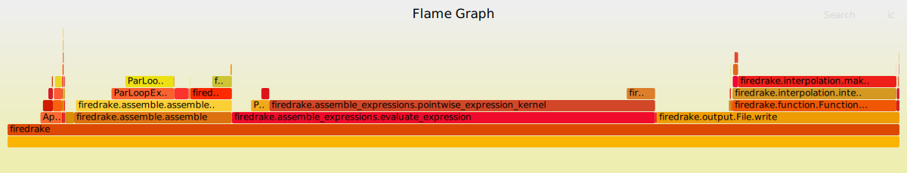

[Flame graphs](https://www.brendangregg.com/flamegraphs.html) are a very useful entry point when trying to optimise your application since they make hotspots easy to find.

This guide will explain how to generate interactive flame graphs for your Firedrake scripts that will look something like this:



## Generating the flame graph

To generate a flame graph from your Firedrake script you need to:

1. Run your code with the extra flag `-log_view :foo.txt:ascii_flamegraph`. This will run your program as usual but output an additional file called `foo.txt`.

2. Visualise the results. This can be done in one of two ways:
  
    - Generate an SVG file using the `flamegraph.pl` script from [this repository](https://github.com/brendangregg/FlameGraph) with the command:

        ```bash
        $ ./flamegraph.pl foo.txt > foo.svg
        ```

        You can then view the output file in your browser.

    - Upload the file to [speedscope](https://www.speedscope.app/) and view it there.

## Adding your own events

It is very easy to add your own events to the flame graph and there are a few different ways of doing it.
The simplest methods are:

- With a context manager:
    
    ```python
    from firedrake.petsc import PETSc

    with PETSc.Log.Event("foo"):
        do_something_expensive()
    ```

- With a decorator:

    ```python
    from firedrake.petsc import PETSc

    @PETSc.Log.EventDecorator("foo")
    def do_something_expensive():
        ...
    ```

    If no arguments are passed to `PETSc.Log.EventDecorator` then the event name will be the same as the function.

## Extra information

- The `flamegraph.pl` script assumes by default that the values in the stack traces are sample counts.
  This means that if you hover over functions in the SVG it will report the count in terms of 'samples' rather than the correct unit of microseconds.
  A simple fix to this is to include the command line option `--countname us` when you generate the SVG.

- If you use PETSc stages in your code these will be ignored in the flame graph.

- If you call `PETSc.Log.begin()` as part of your script/package then profiling will not work as expected. 
  This is because that will start PETSc's default (flat) logging while we need to use nested logging instead.

  This issue can be avoided with the simple guard:
  
  ```python
  from firedrake.petsc import OptionsManager

  # If the -log_view flag is passed you don't need to call 
  # PETSc.Log.begin because it is done automatically.
  if "log_view" in OptionsManager.commandline_options:
      PETSc.Log.begin()
  ```